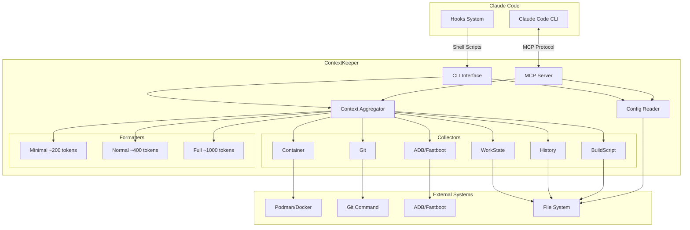
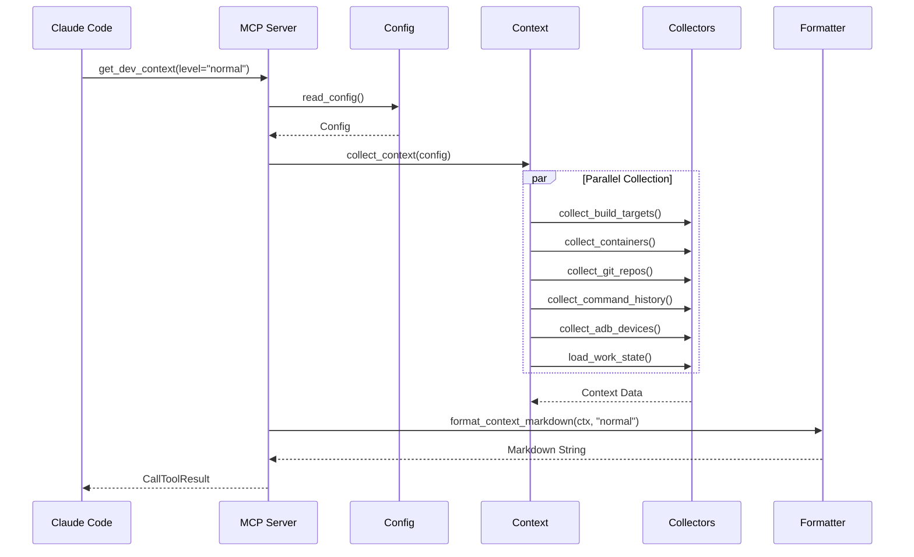
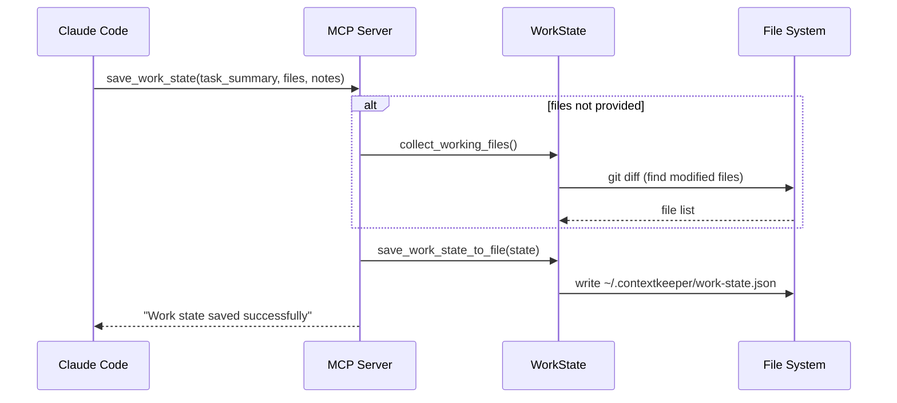
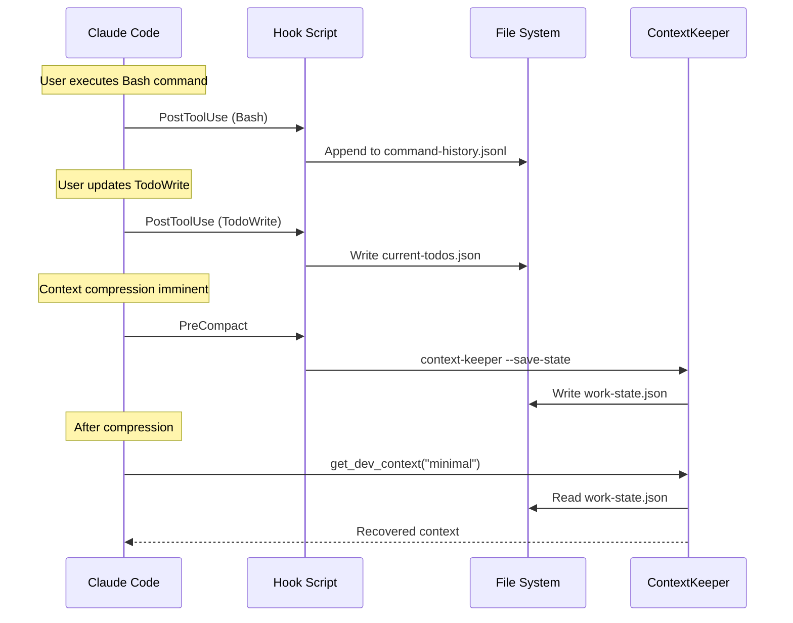
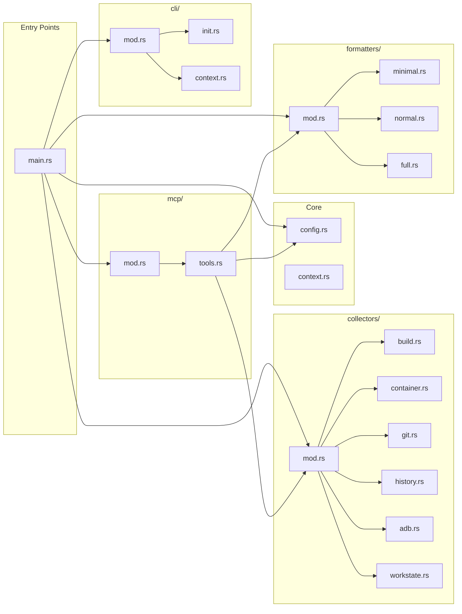
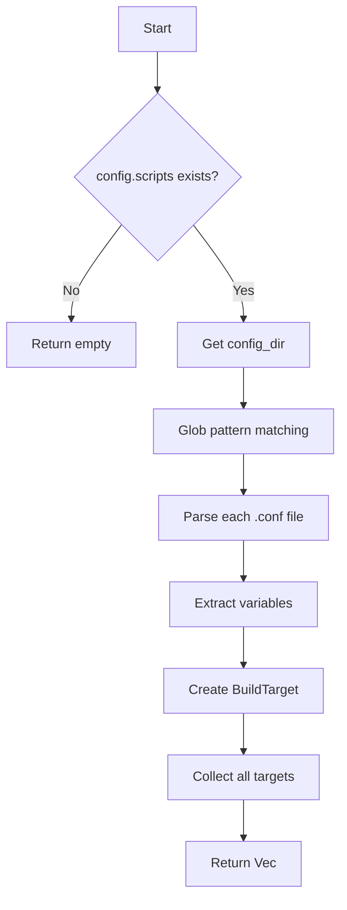
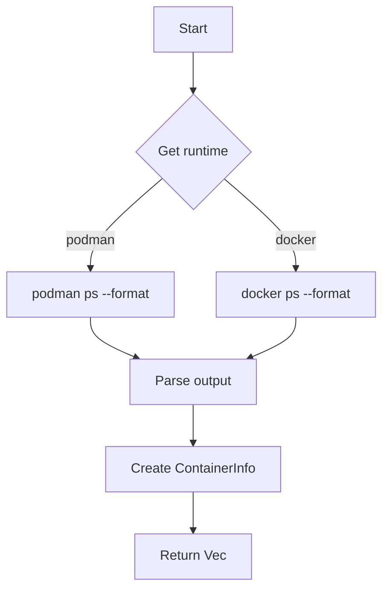
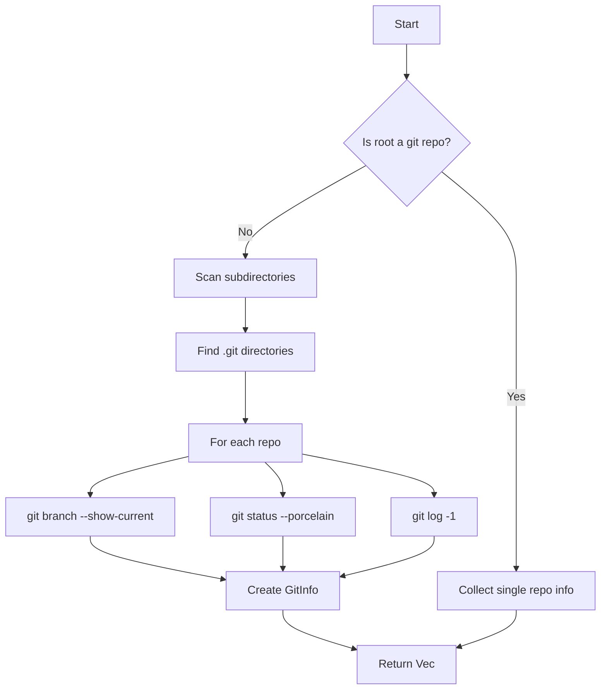

# ContextKeeper Architecture

## Overview

ContextKeeper は MCP (Model Context Protocol) サーバーとして動作し、AI エージェントに開発環境のコンテキストを提供します。

## System Architecture



## Data Flow

### 1. Context Collection Flow



### 2. Work State Save Flow



### 3. Hook Integration Flow



## Module Structure



## Collector Details

### BuildScript Collector



**Parsed Variables:**
- `TARGET_NAME`
- `TARGET_DESCRIPTION`
- `CONTAINER_NAME`
- `LUNCH_TARGET`
- `CAN_EMULATOR`
- `CAN_FLASH`

### Container Collector



### Git Collector



## Output Format Levels

### Minimal (~200 tokens)

圧縮後の復帰用。必要最小限の情報のみ。

```markdown
# Context Recovery (Minimal)

**Hint:** Build commands must run inside container.
**Task:** Implementing feature X
**Files:** src/main.rs, src/lib.rs
**Changed repos:** project (2M)
**Device:** ABC123 (adb)

---
*Run `get_dev_context` with level="normal" for more details.*
```

### Normal (~400 tokens)

通常使用。バランスの取れた情報量。

```markdown
# Development Context

## Saved Work State
- **Task:** Implementing feature X
- **Working files:** src/main.rs, src/lib.rs

## AI Hints
> Build commands must run inside container.

## Git Status (changes only)
| Repository | Branch | Status |
|------------|--------|--------|
| project | main | 2M |

## Active Containers
- aosp-build (Up 3 hours)
```

### Full (~1000 tokens)

完全な情報。デバッグやセットアップ確認用。

```markdown
# Development Context (Full)

## Project
- **Name:** My Project
- **Type:** aosp

## Saved Work State
...

## AI Hints (Important)
...

## Available Build Targets
| Target | Description | Container | Lunch Target |
...

## Active Containers
...

## Recent Relevant Commands
| Time | Command |
...

## Git Status
| Repository | Branch | Status | Last Commit |
...

## Connected Devices
| Serial | State | Type |
...
```

## File Storage

```
~/.contextkeeper/
├── command-history.jsonl    # Captured commands (by log-commands.sh)
├── current-todos.json       # Current todos (by save-todos.sh)
├── recent-files.json        # Recently edited files (by track-files.sh)
└── work-state.json          # Saved work state
```

### command-history.jsonl

```json
{"timestamp": "2026-02-27T10:30:00Z", "command": "lunch sdk_car_dev-trunk_staging-userdebug"}
{"timestamp": "2026-02-27T10:31:00Z", "command": "source build/envsetup.sh"}
```

### work-state.json

```json
{
  "saved_at": "2026-02-27T10:30:00Z",
  "trigger": "manual",
  "task_summary": "Implementing rate limiter",
  "working_files": ["src/main.rs", "src/lib.rs"],
  "notes": "Token bucket implementation in progress",
  "todos": [
    {"content": "Add unit tests", "status": "pending"},
    {"content": "Update documentation", "status": "in_progress"}
  ]
}
```

## MCP Protocol

ContextKeeper は [Model Context Protocol](https://modelcontextprotocol.io/) を実装しています。

### Tools

| Tool | Parameters | Description |
|------|------------|-------------|
| `get_dev_context` | `level?: "minimal" \| "normal" \| "full"` | 開発コンテキストを取得 |
| `save_work_state` | `task_summary: string, working_files?: string[], notes?: string, todos?: string` | 作業状態を保存 |

### Transport

- **Type:** stdio
- **Protocol:** JSON-RPC 2.0 over stdin/stdout
